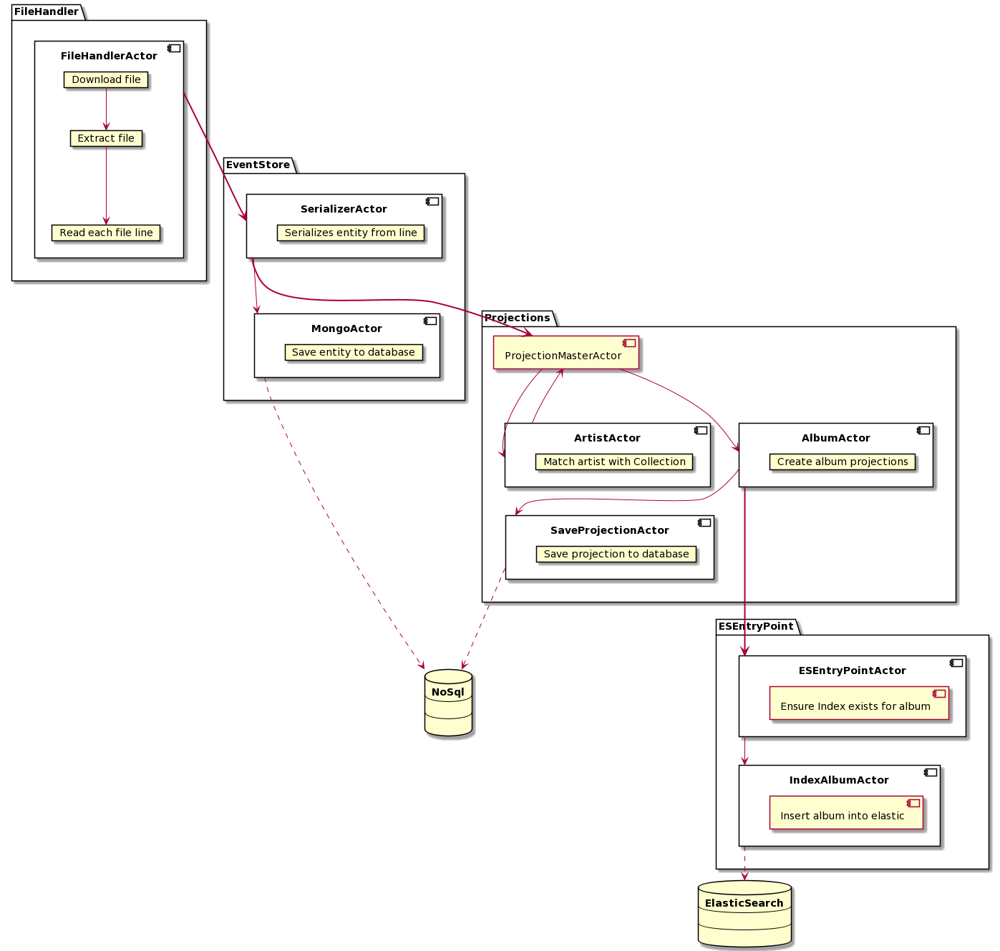

# DATA INGESTION ASSIGNMENT
a distributed solution for data

## Base image

All docker images are built from a base image, run the script in `Docker` folder to build it

## Architecture

[diagram source](http://www.plantuml.com/plantuml/umla/VLB1Rjim3BthAuZUtIyeWXQjX_MGeLYEGJ3GDXrhawLCPDeqG_zzibnRLZBi48JcUtnyf7ZFWbwElL47h7_Xdk2BDlGLRMF80pAq7VnH0BNh3ywIbIN-K8lx965a1Hxw1cwUt9ir3Xje0_bcOEmRNk3bIJpMak3p4lrEePAmxY8EHjkHvDj0-b0VQlPQlfALZJXF0qvyONL3NgFHvuLJpetE38PGeEKTMk_wiMLibkcjdTsxMQh7Ip5yfKb673GeM257eSprYtS_gHRjxANXXAoHPM7xq6D6VF2YMMOOlVp0-B7qiqO9EyH8XJSj7JmwOqRzQ2gNDDMnJugc-eVYeoSK0XoeS4XZNAiDkqZJfFM7TAwRDfVq_hkzSbDQyUylJbl9rvT1SqlYhE6sj7pq1C-seHFGIRCmjCwFG-sk1ecyV3TwIEMYpvR9owWHS7501bbqlPliJ_D0FnnHKy4s87VLwflR_3OXB8f2JN-xH9zq9devVcu8VTrTbwbzmr0y5Iiuipf_XhvLgkqmaBQLCyqkf1WL3uaGnZjMAbxpxUrgygSKBolY1OOVX99qRZ5pLnGfCt7I0QavYlbq0Ig5UUDKaFhFpwY8azhoALIAezwqENLFjZdsvYy0)